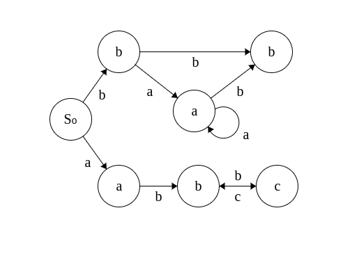

# RegEx-Matcher
Matches the input string against 
$$\text{RegEx:} ba^{\star}b + a(bc)^{\star}$

The NFA has been constructed using Glushkov's Algorithm (in this case is a DFA)
$$e' = b_1 a_2^* b_3 \quad + \quad a_4 (b_5 c_6)^*$$

 $ P(e') = \{b_1, \; a_4 \}$ \
  $ D(e') = \{b_3, \; a_4, \; c_6\}$ \
  $ F(e') = \{b_1 b_3, \; b_1 a_2, \; a_2 b_3, \; a_2 a_2, \; a_4 b_5, \; b_5 c_6, \; c_6 b_5 \}$

 
